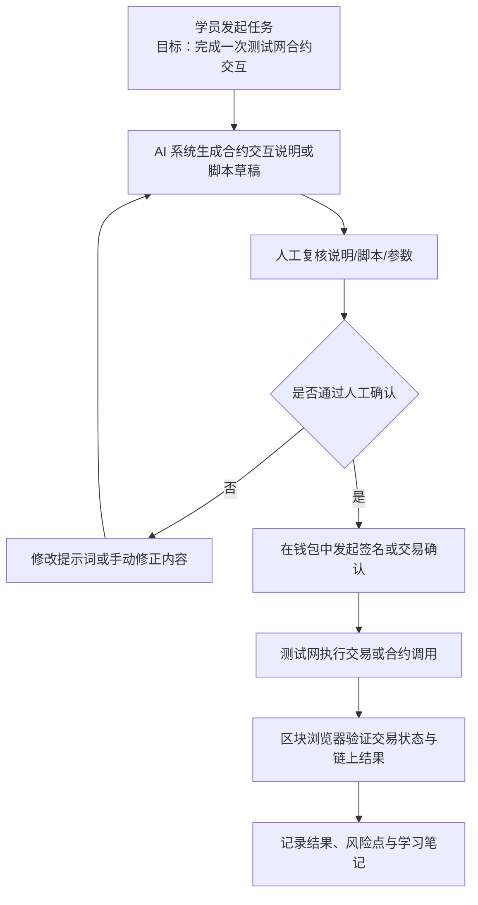

# 最小 AI × Web3 工作流

这份笔记的目标不是设计一个复杂产品，而是先看清楚：当 AI 系统开始接近链上执行时，哪些步骤可以交给 AI 辅助，哪些步骤必须保留给人，哪些地方会涉及签名、付款、授权和结果验证。

我选择的最小示例是：

**AI 生成合约交互说明 → 人工复核 → 钱包确认 → 测试网执行 → 区块浏览器验证**

## 一、流程图

## 二、谁发起任务

这条流程的发起者是**学员 / 用户**。

也就是说，任务不是 AI 自己凭空开始的，而是由人提出明确目标，例如：

- “帮我生成一份 SimpleStorage 合约的交互说明”
- “帮我整理 Sepolia 测试交易记录”
- “帮我写一份合约调用检查清单”

在这个阶段，人负责定义任务目标和边界。

## 三、谁执行每一步

### 1. AI 系统执行的部分

AI 适合做这些事情：

- 解释合约函数在做什么
- 生成交互步骤说明
- 生成脚本草稿或检查清单
- 整理交易记录和学习笔记

这些动作的特点是：**主要在生成、解释、整理层面**，还没有真正触发链上状态变更。

### 2. 人执行的部分

人必须负责这些事情：

- 判断 AI 输出是否合理
- 检查目标地址、函数、参数、网络是否正确
- 决定是否继续执行
- 在钱包里签名或确认交易
- 去区块浏览器验证链上结果

这些动作的特点是：**它们直接关系到权限、安全和执行结果**。

## 四、哪一步需要钱包签名 / 付款 / 授权

这条流程里，最关键的链上边界在这里：

### 钱包签名

当流程进入“钱包确认”阶段时，就已经不再是普通的文本辅助，而是开始接近真实执行。

钱包签名可能对应不同风险等级的动作：

- 消息签名
- 代币授权
- 合约调用
- 测试网转账
- 合约部署

这些动作不能简单理解成“点一下确认”，必须先看清楚钱包弹窗里到底请求了什么。

### 付款 / Gas

只要是链上交易或写入型合约调用，就通常会产生 Gas 成本。

即使在测试网里，Gas 也是重要学习点，因为它反映的是：

- 这是不是一次真实交易
- 这笔交易复杂不复杂
- 这次调用是否进入了执行层

### 授权

授权虽然不一定等于马上转账，但它可能允许某个合约在之后代表你操作资产或执行某类动作。

所以授权本身也属于高风险节点，必须人工理解后再确认。

## 五、哪一步必须人工确认

至少有三类步骤必须人工确认：

### 1. AI 输出审查

AI 生成的说明、脚本、参数和步骤不能直接信任。人必须先判断：

- 这个函数是不是我真的想调用的
- 参数是否正确
- 网络是否正确
- 目标地址是否正确

### 2. 钱包弹窗确认

任何涉及签名、授权、转账、部署或合约写入的动作，都必须由人亲自看钱包弹窗并确认。

这一步不能默认交给 AI 自动通过。

### 3. 结果验证

交易提交后，不能只看“钱包好像成功了”，还要人工去区块浏览器确认：

- 交易哈希
- 状态
- 区块高度
- Gas 使用量
- 目标地址
- 日志或事件

## 六、如何验证结果

结果验证主要通过**区块浏览器**完成，例如 Sepolia Etherscan。

可以验证的内容包括：

- 交易是否成功
- 交易在哪个区块被打包
- Gas 使用量是多少
- 是否真的调用到了目标合约
- 是否真的修改了链上状态
- 是否产生了预期事件

如果是只读调用，还可以通过合约读方法再次检查状态值是否变化，例如：

- 调用 `setNumber(42)` 后，再调用 `getNumber()`
- 如果返回值变成 `42`，说明写入结果和预期一致

## 七、可能的风险点

### 1. AI 解释错了函数或参数

AI 可能把函数用途解释错，或者建议了不合适的参数，导致后续操作偏离原本目标。

### 2. 人没有认真复核

如果人只是“走流程式点确认”，那 human-in-the-loop 就会失效。真正的风险不是 AI 参与，而是人在关键节点上没有履行判断责任。

### 3. 钱包弹窗被误解

很多新手会把签名、授权和交易混为一谈。实际上，它们的风险差异很大。误把高风险授权当作普通登录，是常见问题。

### 4. 地址或网络填错

如果把测试网、主网、合约地址、接收地址弄错，即使流程本身没问题，也可能执行到错误目标。

### 5. 只看 AI 输出，不看链上验证

AI 说“成功了”不算真正成功，必须以链上结果和区块浏览器为准。

### 6. 自动化边界不清

如果未来把这条流程升级成 agent workflow，最危险的问题之一就是：哪些动作可以自动做，哪些动作必须停下来等人确认。如果边界不清，自动化能力越强，风险越大。

## 八、这条流程真正想说明什么

这条最小 AI × Web3 工作流真正想说明的是：

- AI 很适合生成说明、整理信息、草拟脚本
- 钱包签名、授权、付款和链上写入属于执行边界
- 一旦跨过执行边界，就必须把人工确认和结果验证放回流程中心

所以 AI × Web3 不是“让 AI 自动帮我完成链上操作”，而是：

**让 AI 帮我理解、准备和组织操作；让人保留对高风险动作的最终判断权；再用链上验证工具确认结果。**

## 九、总结

如果用一句话概括这条最小流程，那就是：

**人发起任务，AI 负责辅助生成和整理，人负责复核与签名，链上系统负责执行，区块浏览器负责验证。**

这也是我目前理解 AI 与 Web3 边界最清楚的一种方式。
